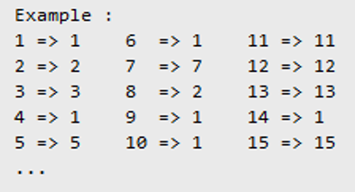

## Example of TDD Implementation
Demo on HARA Engineering Tech Talk on August 09, 2018.

Simple we-do-together demo with other engineering members to create a function with TDD way.

### Function Requirement
Parameter: number.

Return: 
- Total number of holes if the number have holes
- The number if the number doesn’t have any hole

Example:

### Test Library
- [mochaJS](https://mochajs.org/)
- [IstanbulJS](https://istanbul.js.org/)
- [NodeJS' built-in assert module](https://nodejs.org/api/assert.html)